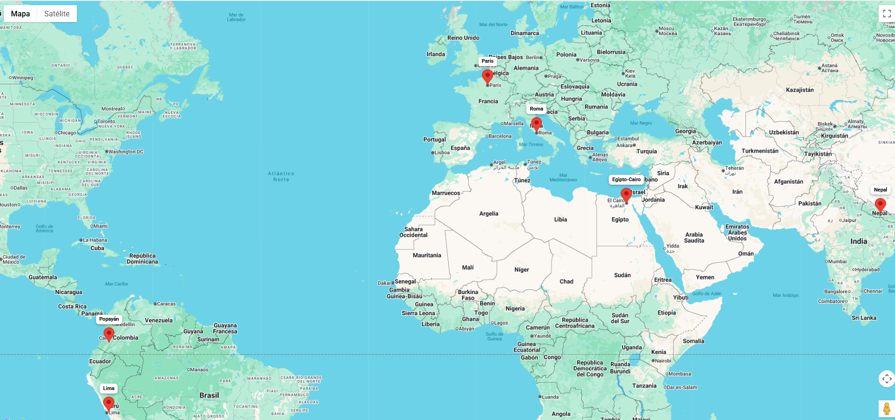
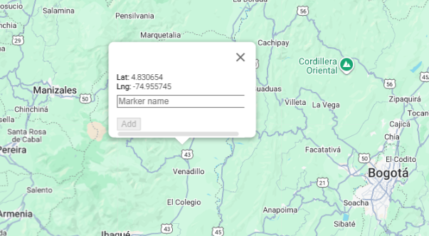
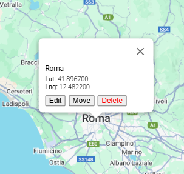

# AppMaps Project

This is a full-stack application with a Spring Boot backend and a React frontend.
The application allows visualization and management of markers on a map connected to a MySQL database.

## Backend
- **Directory:** `/maps`
- **Technology:** Spring Boot
- **Database:** MySQL

## Frontend
- **Directory:** `/mapsfrontend_`
- **Technology:** React

## Features

When the application runs:

- A **map** is displayed with markers loaded from the database.
- The application supports **CRUD operations** on the markers:
  - **Create:** Clicking anywhere on the map adds a new marker, allows entering a name, and saves it to the database.
  - **Read:** All existing markers are displayed on the map.
  - **Update:** Clicking on a marker allows editing its name or moving it to a new location.
  - **Delete:** Clicking on a marker allows removing it from the database.

### Visualize Markers

### Create Marker

### Marker Actions

